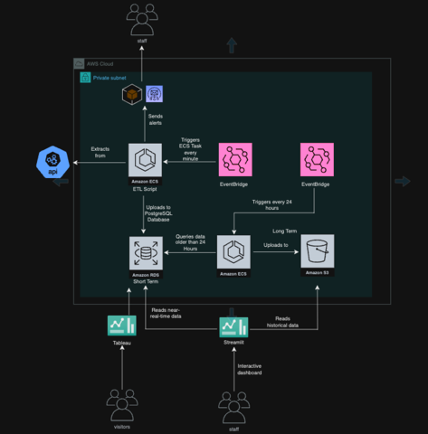
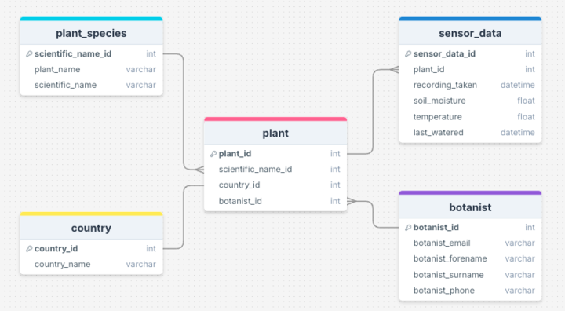
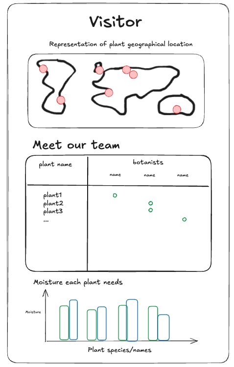
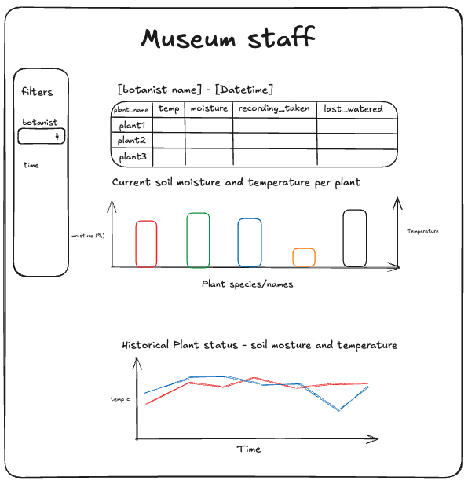
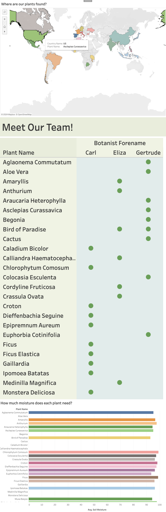
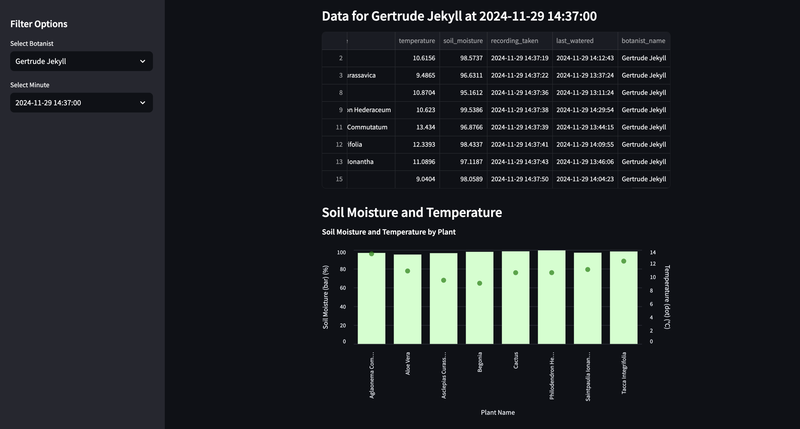
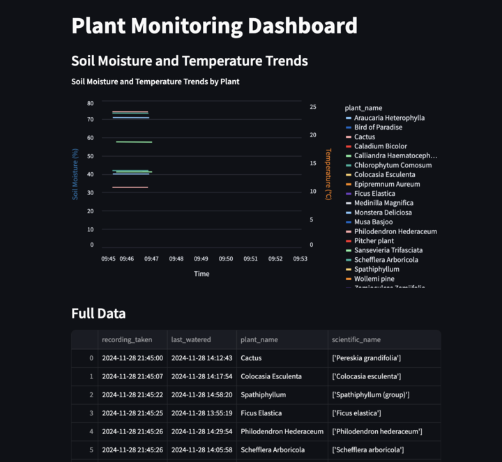

# 🌱 LMNH Botany Pipeline

## Project Overview: Liverpool Natural History Museum Plant Health Monitoring
**Introduction**
The Liverpool Natural History Museum (LNMH) has embarked on an exciting initiative to monitor the health of plants in its newly opened botanical wing. This wing highlights the diversity and importance of regional plant life, drawing interest from families, students, and researchers alike. 
To support the maintenance of its plant conservatory, LNMH seeks to implement a robust system to monitor plant health, leveraging sensors and cloud-based solutions to address challenges faced by their gardening team.

**Project Goals**
The primary objective is to build a scalable and efficient cloud-hosted data pipeline to track and monitor the health of plants in real-time and over time. The solution aims to:

- Retrieve, clean, and store sensor data efficiently.
- Alert gardeners to potential plant health issues.
- Provide actionable insights through visualizations.

## Architecture

## ERD Diagram 

## Dashboards

**Wireframes**

**Visitors**

**Staff**

## 🛠️ Getting Setup

**Python version and environment**

1. Install older version of python:
- `brew install python@3.9` 

2. Create a virtual environment:
- `python3.9 -m venv .venv`
  (If you have an existing venv, run `deactivate` and delete the venv folder and empty trash first)
- Then activate it by running `source .venv/bin/activate`

1. Install and connect pyenv:
- `brew install pyenv`
- `pyenv install 3.11.5`
- `pyenv local 3.11.5`

**Microsoft SQL Server**
1. Install SQLCMD - Enables connection to SQL Server
- `brew install sqlcmd`

2. `pymssql` requires extra dependencies:
- Run `brew install freetds`
- Then run `pip install pymssql` 
  (if pymssql is already installed then run `pip uninstall pymssql` before installing it again to link it to FreeTDS)

**Other setup**

1. **AWS credentials** Ensure you have a `.env` file with your AWS credentials (DB_HOST, DB_PORT, DB_PASSWORD, DB_USER, DB_NAME, SCHEMA_NAME).
   
2. **Requirements** Install necessary packages: `pip install -r requirements.txt`.

3. **Database Setup** Ensure your Microsoft SQL Server database is set up: 
   - To create schemas: `python create_schemas.py` -- Only when required.
   - To connect to database: `python pipeline/connect_to_database.py` -- Only needs to be ran once per session.
   - To run full ETL process: `python pipeline/etl.py`

**Useful commands**
- To connect to the RDS database run `bash connect.sh`
- To see all of the schemas run: 
`SELECT TABLE_SCHEMA, TABLE_NAME
FROM INFORMATION_SCHEMA.TABLES
WHERE TABLE_SCHEMA = 'alpha' AND TABLE_TYPE = 'BASE TABLE';` 
(follow each command with `GO`)
- To leave session run `quit`

- To see all tables and their elements:
SELECT * FROM alpha.plant_species;
SELECT * FROM alpha.country;
SELECT * FROM alpha.botanist;
SELECT * FROM alpha.plant;
SELECT * FROM alpha.sensor_data;

- streamlit run streamlit/app.py
This allows us to see all visualisations created, on a streamlit locally-hosted dashboard.
